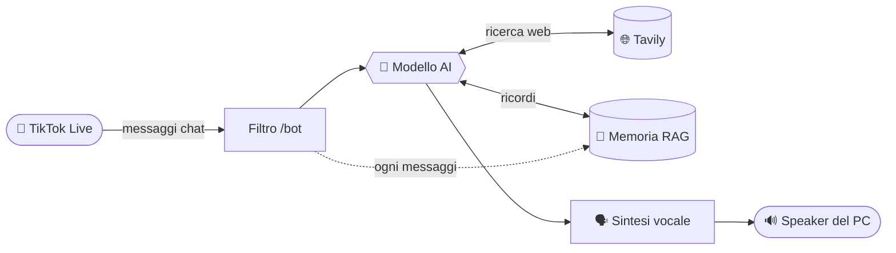

<div align="center">

# 🎤 TikTok Live Bot

**Assistente vocale AI per le tue dirette TikTok.**
Legge la chat, risponde con l'AI ai comandi `/bot` e **parla ad alta voce** dal tuo PC — ringrazia follower e regali, ricorda le live passate e può cercare sul web. Tutto da una dashboard, niente file da editare.


</div>

---

> ⚠️ Usa la libreria non ufficiale [TikTokLive](https://github.com/isaackogan/TikTokLive) per leggere la chat. Non è affiliata a TikTok: usala a tuo rischio.

## ✨ Caratteristiche

| | |
|---|---|
| 💬 **Risposte AI in chat** | Chi scrive `/bot <domanda>` riceve una risposta generata dall'AI… |
| 🔊 **…letta ad alta voce** | …e pronunciata dal PC con voci cloud (Edge) o locali offline (Supertonic). |
| 🧠 **Memoria persistente** | Ricorda cosa è stato detto nelle live, anche di giorni prima, e lo richiama quando serve. |
| 🌐 **Ricerca web** | Opzionale via Tavily: il bot cerca su internet quando glielo chiedi. |
| 🎁 **Ringraziamenti automatici** | Saluta i nuovi follower e ringrazia chi manda regali (attivabili dalla UI). |
| 🎛️ **Tutto da dashboard** | Modello, chiavi, persona, voce, memoria: zero file da toccare. |

## 🔄 Come funziona



Ogni messaggio passa dal filtro; solo i `/bot` vengono elaborati dall'AI, che può attingere a memoria e ricerca web prima di rispondere. La risposta viene sintetizzata in voce e riprodotta. In parallelo, **ogni** messaggio della chat viene salvato in memoria.

## 🧠 Memoria persistente (RAG)

Il bot ha una memoria a lungo termine che sopravvive a riavvii e cambi di sessione:

- **Cosa salva** — ogni commento della live (e ogni scambio `/bot`), in append-only.
- **Come cerca** — ogni voce viene trasformata in un *embedding* (OpenAI) e la ricerca usa la **similarità del coseno**; per domande tipo *"qual è stato l'ultimo messaggio?"* passa in modalità **cronologica** (più recente prima).
- **Due file in lockstep** — `messages.jsonl` (leggibile/esportabile) + `embeddings.f32` (vettori). Scritti insieme senza `await` in mezzo: non possono mai disallinearsi, e un crash a metà scrittura viene recuperato troncando al più corto.
- **Il bot la usa da solo** — tramite il tool `recall_memory`, quando qualcuno fa riferimento al passato (*"ti ricordi?"*, *"come l'altra volta"*, *"cosa ha detto X"*).
- **La controlli tu** — dalla scheda **Impostazioni** vedi tutte le voci salvate e puoi svuotarle con un click.

> La memoria usa gli embedding di OpenAI: serve la chiave OpenAI anche con un modello di chat locale. Senza chiave, la memoria è semplicemente disattivata.

## 🤖 Modelli AI

Scegli il modello dalla dashboard; il provider è gestito sotto il cofano.

| Modello | Dove gira | Note |
|---|---|---|
| **GPT-4o mini** ⭐ | cloud OpenAI | Facile, affidabile, costa centesimi. Serve una API key. |
| **Llama 3.1 8B** · **Qwen 2.5 7B** · **Gemma 3 4B** | locale via [Ollama](https://ollama.com) | Gratis e privato, ma serve un PC discreto. I modelli piccoli usano i tool in modo meno affidabile. |

Per i modelli locali, installa [Ollama](https://ollama.com) e scarica il modello una volta:

```bash
ollama pull llama3.1:8b
```

## 🔊 Voci

- **Edge** (cloud, gratis, nessuna chiave) — voci italiane e inglesi, qualità alta.
- **Supertonic** (locale, gira su CPU) — voci offline, nessuna dipendenza da internet.

## 🚀 Installazione

```bash
git clone https://github.com/itsma77e/TikTok-Live-Bot.git
cd TikTok-Live-Bot

python -m venv .venv
# Windows
.venv\Scripts\activate
# macOS / Linux
source .venv/bin/activate

pip install -r requirements.txt
```

Le chiavi API puoi inserirle **direttamente dalla dashboard** (scheda Impostazioni), oppure copiare `.env.example` in `.env` e compilarle lì.

## ⚙️ Uso

```bash
python main.py
```

Apri **http://localhost:8000** e:

1. **Impostazioni** → scegli il modello, incolla la chiave OpenAI (e Tavily se vuoi la ricerca web), regola persona / voce / ringraziamenti, **Salva**.
2. **Chat** → scrivi lo username TikTok della tua live e premi **Connetti**.
3. In diretta, chiunque scriva `/bot <domanda>` riceve una risposta letta ad alta voce dal tuo PC.

I settaggi vengono salvati in locale (`data/settings.json`) e sopravvivono al riavvio.

## 🔒 Privacy

- Chiavi e impostazioni restano **solo sul tuo PC** (cartella `data/`, ignorata da git).
- La memoria della chat è salvata in locale in `data/memory/` — consultabile e cancellabile dalla dashboard.

## 📄 Licenza

[PolyForm Noncommercial 1.0.0](LICENSE.md) — uso libero per scopi **non commerciali**. Non è permesso vendere il software né offrirlo come servizio a pagamento.
